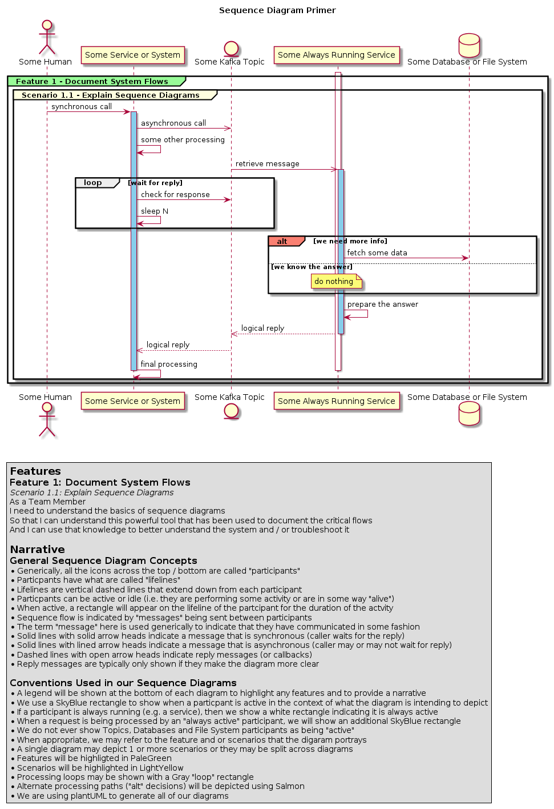

# Sequence Diagrams
Sequence diagrams should be created to describe any complex flow between systems, programming modules, services, etc.

## plantUML
As a standard, we will use plantUML (https://plantuml.com/sequence-diagram).

plantUML is a text-based language for describing sequence diagrams.  They can be automatically rendered by a Java program.  There are plugins for many editors (https://plantuml.com/running).

Below are instructions for getting it working in Atom:

1. Install java on your machine - preferrably the latest openjdk (https://openjdk.java.net/).
1. Install the Atom editor on your machine (https://atom.io/)
1. Install the language-plantuml package in Atom.
1. Install the plantuml-viewer package in Atom.

To see if it is working, paste the following into a new tab:

```plantuml
@startuml
title Sequence Diagram Primer

actor "Some Human" as human
participant "Some Service or System" as system1
entity "Some Kafka Topic" as topic
participant "Some Always Running Service" as system2
database "Some Database or File System" as db_or_fs

group#PaleGreen Feature 1 - Document System Flows
  group#LightYellow Scenario 1.1 - Explain Sequence Diagrams
    activate system2
    human -> system1++ #SkyBlue: synchronous call
    system1 ->> topic: asynchronous call
    system1 -> system1: some other processing
    topic ->> system2++ #SkyBlue: retrieve message
    loop wait for reply
      system1 -> topic: check for response
      system1 -> system1: sleep N
    end
    alt#Salmon we need more info
      system2 -> db_or_fs: fetch some data
    else we know the answer
      note over system2
        do nothing
      end note
    end
    system2 -> system2: prepare the answer
    system2 -->> topic: logical reply
    deactivate system2
    topic -->> system1: logical reply
    system1 -> system1--: final processing
    deactivate system2
  end
end

legend left
  =Features
  ==Feature 1: Document System Flows
  ====Scenario 1.1: Explain Sequence Diagrams
  As a Team Member
  I need to understand the basics of sequence diagrams
  So that I can understand this powerful tool that has been used to document the critical flows
  And I can use that knowledge to better understand the system and / or troubleshoot it

  =Narrative
  ==General Sequence Diagram Concepts
  *Generically, all the icons across the top / bottom are called "participants"
  *Particpants have what are called "lifelines"
  *Lifelines are vertical dashed lines that extend down from each participant
  *Particpants can be active or idle (i.e. they are performing some activity or are in some way "alive")
  *When active, a rectangle will appear on the lifeline of the partcipant for the duration of the actvity
  *Sequence flow is indicated by "messages" being sent between participants
  *The term "message" here is used generically to indicate that they have communicated in some fashion
  *Solid lines with solid arrow heads indicate a message that is synchronous (caller waits for the reply)
  *Solid lines with lined arrow heads indicate a message that is asynchronous (caller may or may not wait for reply)
  *Dashed lines with open arrow heads indicate reply messages (or callbacks)
  *Reply messages are typically only shown if they make the diagram more clear

  ==Conventions Used in our Sequence Diagrams
  *A legend will be shown at the bottom of each diagram to highlight any features and to provide a narrative
  *We use a SkyBlue rectangle to show when a particpant is active in the context of what the diagram is intending to depict
  *If a participant is always running (e.g. a service), then we show a white rectangle indicating it is always active
  *When a request is being processed by an "always active" participant, we will show an additional SkyBlue rectangle
  *We do not ever show Topics, Databases and File System participants as being "active"
  *When appropriate, we may refer to the feature and or scenarios that the digaram portrays
  *A single diagram may depict 1 or more scenarios or they may be split across diagrams
  *Features will be highligted in PaleGreen
  *Scenarios will be highlighted in LightYellow
  *Processing loops may be shown with a Gray "loop" rectangle
  *Alternate processing paths ("alt" decisions) will be depicted using Salmon
  *We are using plantUML to generate all of our diagrams
end legend
@enduml
```

Press ctrl+alt+p and it should open a new tab with a rendered version of your diagram.

As you make changes to your diagram, they will be refelected immediately in the previewer window.

You should see this in the new window:

